% VirtualBox
% Adolfo Sanz De Diego
% Octubre 2017

# Acerca de

## Autor

- **Adolfo Sanz De Diego**
    - Blog: [asanzdiego.blogspot.com.es](http://asanzdiego.blogspot.com.es/)
    - Correo: [asanzdiego@gmail.com](mailto:asanzdiego@gmail.com)
    - GitHub: [github.com/asanzdiego](http://github.com/asanzdiego)
    - Twitter: [twitter.com/asanzdiego](http://twitter.com/asanzdiego)
    - LinkedIn: [in/asanzdiego](http://www.linkedin.com/in/asanzdiego)
    - SlideShare: [slideshare.net/asanzdiego](http://www.slideshare.net/asanzdiego/)

## Licencia

- **Copyright:**
    - Antonio Sarasa Cabezuelo <[antoniosarasa@campusciff.net](mailto:antoniosarasa@campusciff.net)>

## Fuente

- Las slides y sus fuentes las podéis encontrar en:
    - <https://github.com/asanzdiego/curso-intro-linux-web-sql-2016>

# VirtualBox

## ¿Qué es?

- Programa de Software Libre.

- Permite **instalar un Sistema Operativo dentro de otro**.

## Descarga

- https://www.virtualbox.org/wiki/Downloads

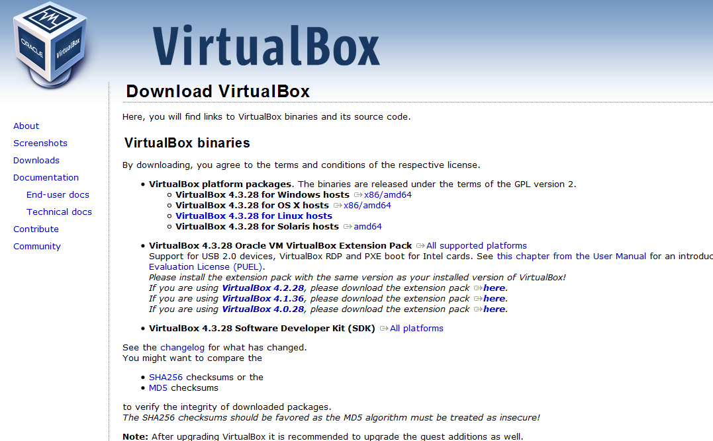

## Instalación

- Elegir la versión adecuada para el Sistema Operativo que tenemos instalado.

- Intalar de la forma habitual dependiendo del Sistema Operativo instalado.

# Descargar Ubuntu

## Ubuntu

- Ubuntu es una **districución Linux** muy utilizada.

## Enlace

- http://www.ubuntu.com/download/desktop

## Donativo

- Al pulsar el botón "Download", nos lleva a una página para realizar una donación,
y si no queremos donar y continuar pulsamos
en la parte inferior en "**Not now, take me to the download**".

## Descarga

- La descarga coomenzará automáticamente, pero si no lo hiciera
pulsamos sobre "**download now**".

# Crear Máquina Virtual

## Abrir VirtualBox

- Abrimos **VirtualBox**:

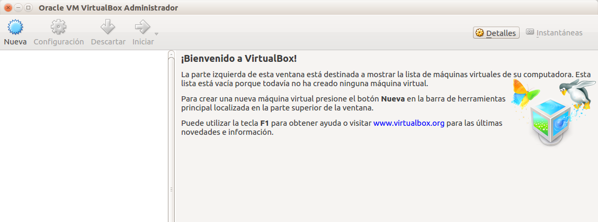

## Nueva Máquina Virtual

- Pulsamos sobre "**Nueva**" para añadir una nueva máquina virtual.

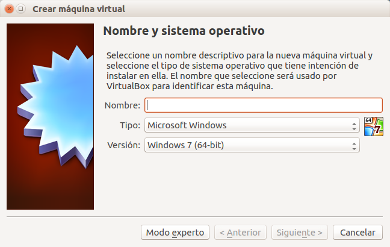

## Nombre Máquina Virtual

- En el asistente insertamos en el nombre "**Ubuntu**".

## Memoria Máquina Virtual

- Elegimos la cantidad de **memoria** reservada a Ubuntu:

## Crear Disco Virtual

- Seleecionamos "**Crear disco virtual ahora**".

## Tipo Disco Virtual

- Seleccionamos **VDI(VirtualBox Disk Image)**.

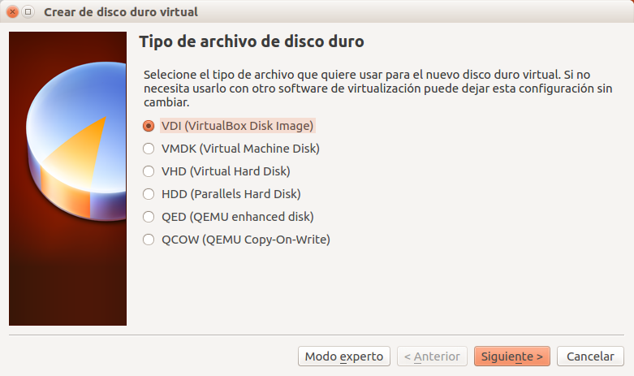

## Tipo Almacenamiento

- Seleccionamos "**Reservado dinámicamente**".

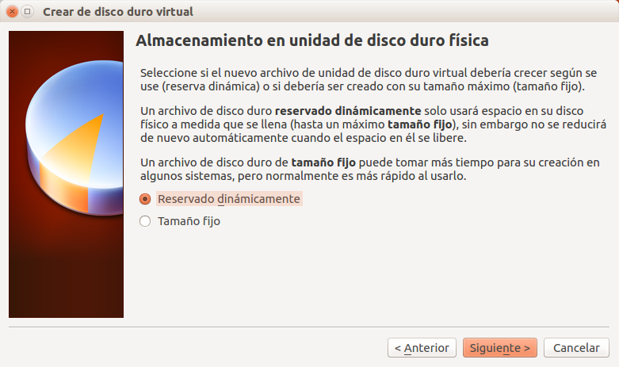

## Ubicación y Tamaño

- Podemos seleccionar **la ubicación y el tamaño** del disco virtual.

## Finalizar

- Si todo ha salido bien nos aparecerá la **máquina recién creada** en VirtualBox.

## Configurar Máquina Virtual

## Abrir configuración

- Seleccionamos máquina recién creada y pulsamos en "**Configuración**".

## Configurar almacenamiento

- Pulsamos sobre "**Almacenamiento**".

## Seleccionar CD Virtual

- Pulsamos sobre el **icono "CD"** del cuadro "Árbol de almacenamiento" del
árbol "Controlador:IDE" que aparece vacío.

## Buscar archivo

- Pulsamos en el **icono "CD"** de la parte de la derecha.

## Seleccionar ISO

- Buscamos el **archivo ISO de Ubuntu** anteriormente descargado.

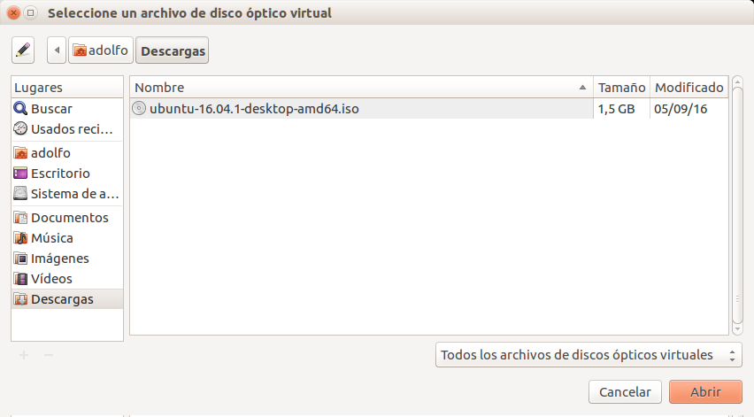

## Cerrar configuración

- Si todo ha salido bien nos aparecerá el **ISO en la configuración**.

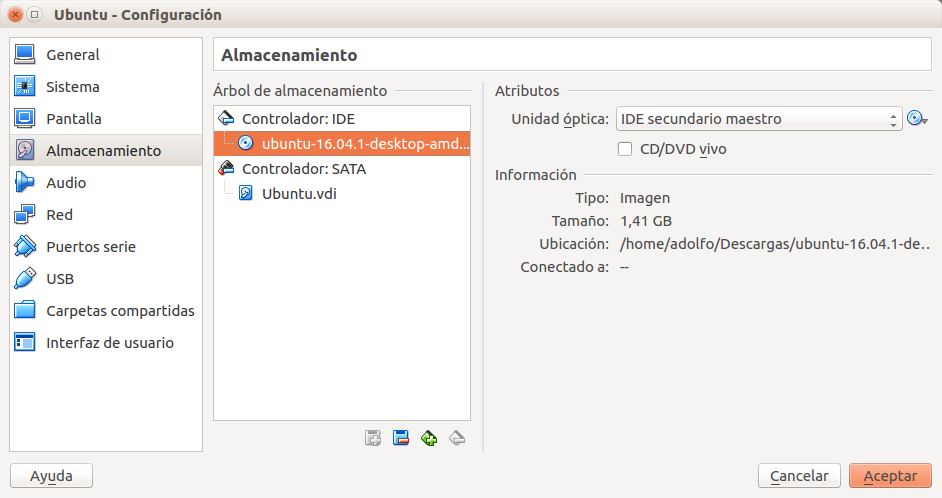

## Finalizar

- Si todo ha salido bien nos aparecerá la **máquina con la ISO** en VirtualBox.

# Intalar Ubuntu

## Iniciar Máquina Virtual

- Pulsamos sobre el icono de "**Iniciar**", y el sistema empieza a cargarse.

## Seleccionar idioma

- Seleccionamos "**Español**" y pulsamos en "**Instalar Ubuntu**".

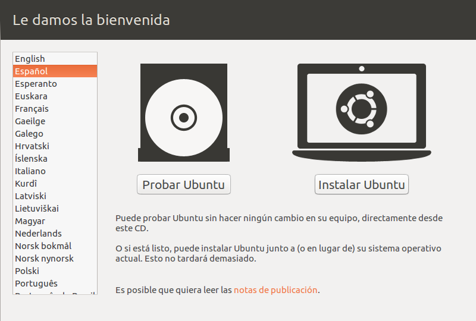

## Descagas opcionales

- Podemos seleccionar ciertas **Descargas opcionales**.

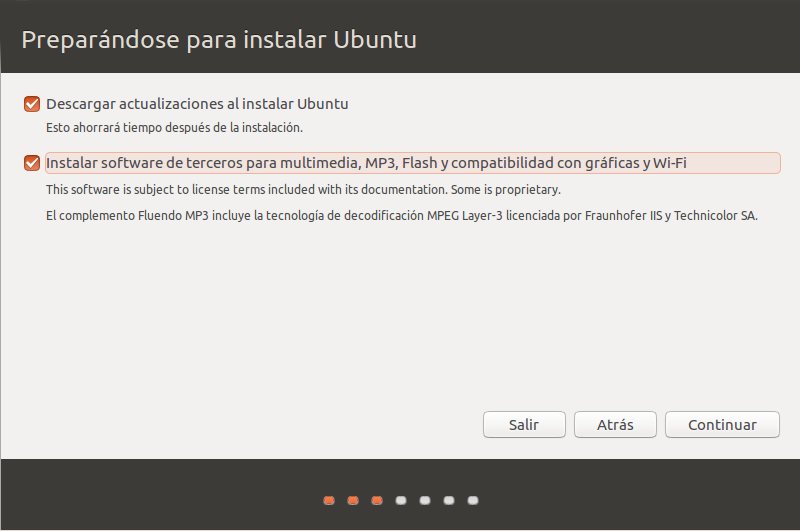

## Tipo de instalación

- Seleccionamos "**Borrar disco e instalar Ubuntu**".

## Adevertencia

- Acepamos la advertencia de "**cambios en los discos**"".

## Ubicación

- Introducimos "**Madrid**" como ubicación.

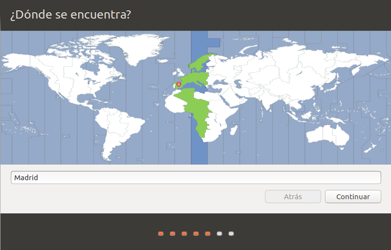

## Teclado

- Seleccionamos el "**tipo de teclado**" de nuestro ordenador.

## Usuario y contraseña

- Introducimos "**Usuario y contraseña**".

## Esperar

- Esperamos a que la instalación termine.

## Reiniciar

- Pulsamos en "**Reiniciar ahora**"

## Pulsar ENTER

- Pulsamos "**ENTER**" para finalizar.

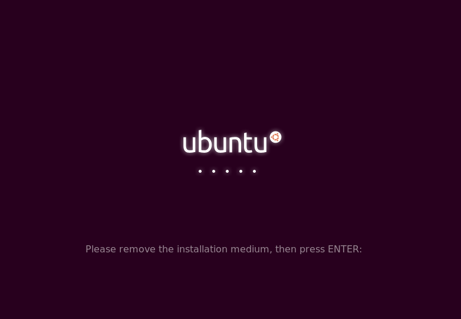

## Cargar Ubuntu

- Después del último paso se **carga Ubuntu**.

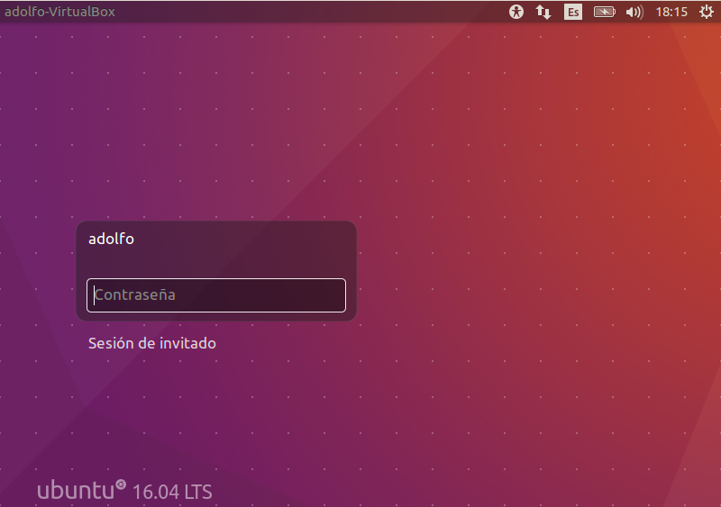

## Apagar Ubuntu

- Pulsamos en el botón situado en la **parte superior derecha**.

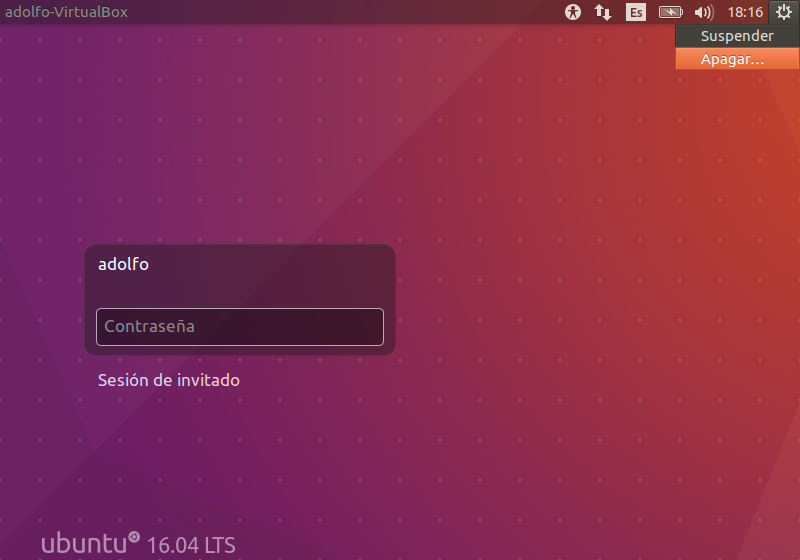

## Finalizar

- Aparece una ventana y pulsamos "**Apagar**"

## Rearancar

- La próxima vez que queramos ejecutar el sistema pusaremos en "**Iniciar**".

# Importar Máquina Virtual

## ¿Qué es eso?

- Podemos **importar máquinas** anteriormente creadas.

## Importar VDI

- Creamos una máquina virtual igual que antes, pero al crear el Disco Virtual seleccionamos el **archivo VDI**.

## Importar OVF

- Pulsamos en "**Archivo > Importar servicio virtualizado...**" y seleccionamos el archivo OVF.

## Exportar OVF

- Para ello pulsamos en "**Archivo > Exportar servicio virtualizado...**" y seguimos las instrucciones.

